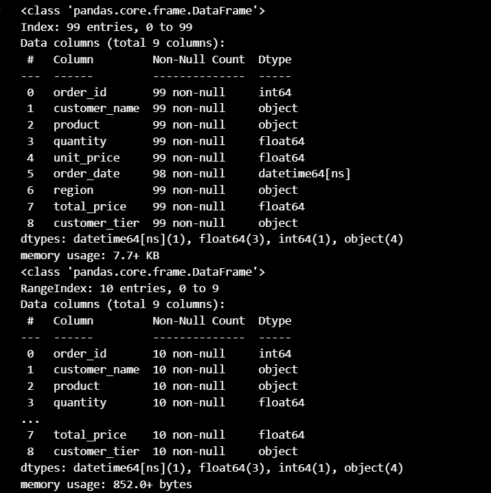

# **DSA 2040A US 2025 Mid Semester Exam: ETL Mini-Project**

Student – Ruth Musanhu (ID: 474)

## 1. Project Overview

This project implements a complete ETL (Extract, Transform, Load) pipeline as part of the DSA 2040A Mid Semester Exam. The goal is to load raw and incremental data, apply transformations to improve structure and quality, and save the results in a structured format (SQLite databases). This ensures the data is clean, well-organized, and ready for analysis.

---

## 2. ETL Phases

#### 🔹 Extract (`etl_extract.ipynb`)

* Loaded `raw_data.csv` and `incremental_data.csv`
* Inspected data using `.head()` and `.info()`
  - was done to better understand the data structure and identify quality issues
* Observed missing values, possible duplicates, and column structures
  - both datasets had missing values in most of the columns and some incorrect data types
  

#### 🔹 Transform (`etl_transform.ipynb`)
This phase addressed the issues observed during the extraction phase by applying the following

* Removing of  duplicate rows, one was discovered in the raw dataset
* Handled missing values by filling with zeroes
* Created `total_price` column from `quantity * unit_price`
* Categorized customers into `Bronze`, `Silver`, and `Gold` tiers based on total price
* Converted date columns to datetime objects (with coercion for invalid entries like the missing values we replaced with zeros)

This phase produced cleaned data which was loaded into the transformed/ folder

#### 🔹 Load (`etl_load.ipynb`)
- The last task involved loading the cleaned transformed data into a peristent storage format.
- The SQLite database was used in this project
- The processes included 

  * Load transformed data into two SQLite databases: `full_data.db` and `incremental_data.db`
  * Verify data is stored by running `SELECT * LIMIT 5` queries
  * Save previews of loaded data into CSVs in the `loaded/` folder

---

## 3. Tools Used

* Python 
* Pandas
* SQLite (`sqlite3`)
* VS Code
* GitHub

---

## 4. How to Run the Project

1. Clone the repository:

2. Open in VS Code or Jupyter

3. Run each notebook in order:

   * `etl_extract.ipynb`
   * `etl_transform.ipynb`
   * `etl_load.ipynb`

4. Check outputs in the `transformed/` and `loaded/` folders

---

## 5. Data Visualization

Below is a chart showing the number of customers per tier after transformation:

